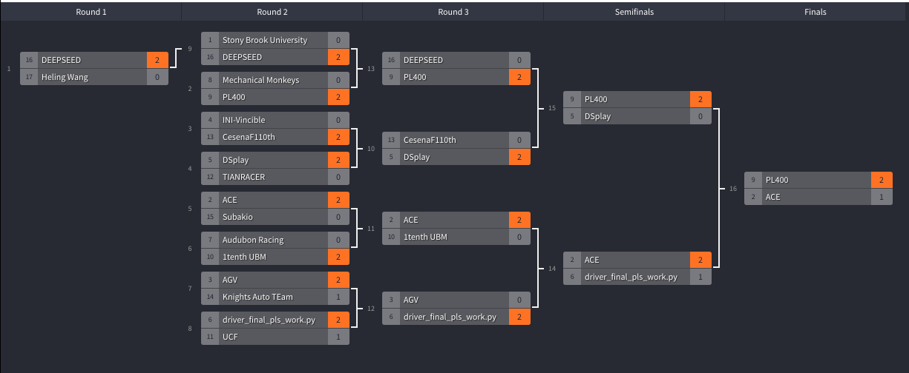

F1Tenth ICRA 2022 - Virtual Competition Head-to-Head Results
==================

This repo includes the log files from the F1TENTH ICRA 2022 race. It can replay the F1Tenth Log files generated by Riders.ai to show the results.
To replay each race, use the log player provided here. Follow the instructions to install the library in a virtualenv. Then, change the path specified in `src/main.py` to the `.jsonl` file you're interested to review from this repository and run `src/main.py`.

# Installation

First install [virtualenv](https://virtualenv.pypa.io/en/latest/installation.html), if you haven't.

```bash
virtualenv -p python3 venv
source venv/bin/activate
```

After that, install dependencies:

```bash
pip install -e src/gym
pip install -e src/player
```

To reply the logs, change the log file path and finally run `main.py`:

```bash
python src/main.py
```

Here is the overview of the tournament with all rounds, races and teams.

